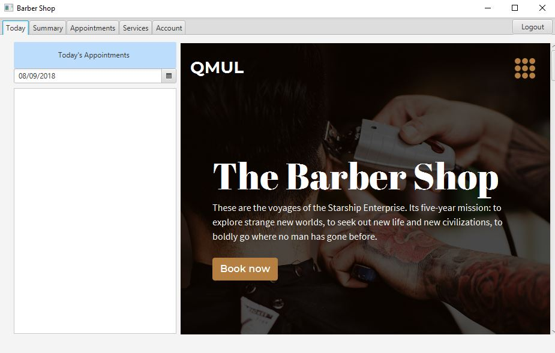

# Barber Program

A desktop client, written for employees of a barber shop. 

- ### Technologies
	- [ ] Front-End: Java/FX, HTML5, CSS3, JavaScript
	- [ ] Back-End: PHP, MySQL, XML

## Landing Page

Requirements:
	1. Must be able to login/logout with unique accounts
	2. Must be able to see todays bookings from the website on landing page
	3. Must be able to click on individual bookings for more info (client contact etc)
	4. Must be able to edit/delete/move bookings 
	5. Must be able to add services
	6. Service options can only be given from the barbershop owner
	7. Must be able to set service prices
	8. Must be able to add/edit/delete services
	9. Must be able to set working hours
	10. Must be able to show summary of hours worked
	11. Must be able to show income earned
	12. Must be able to show statistics of best days earned
	13. Must be able to edit user account details